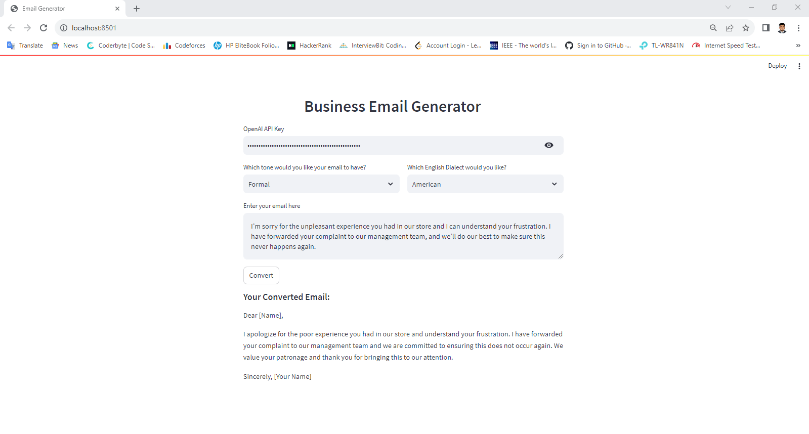

# Email-Generator-GPT

This repo serves as a template for how to make your own LangChain apps on Streamlit.

## Deploy on Streamlit

Note that when setting up your StreamLit app you should make sure to add `OPENAI_API_KEY` as a secret environment variable.
